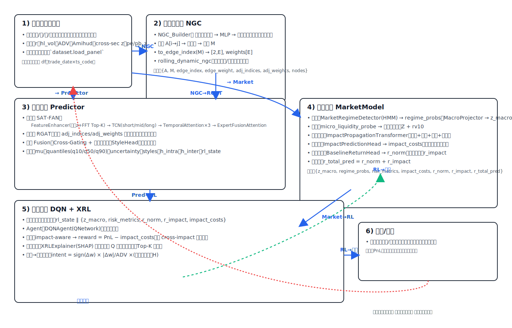

## FAD: Financial Deep RL with Impact-aware Execution

面向大资金、强风险厌恶与价格冲击约束的股票深度强化学习研究框架。项目包含：
- 伪行业映射（图社区）生成，用于行业级约束与跨标的冲击建模
- 预测骨架：股票内 TCN-MoE × 股票间 Relational GAT，跨视角耦合与风格矩阵（来自 GAT 表示）
- 市场模块：Regime 网络（骨架）
- 执行与成本：可微价格冲击与多日执行（骨架）
- 受约束 RL：PPO-Lagrangian（最小可运行示例）

当前仓库已提供可运行的伪行业映射流水线与三阶段训练骨架（Stage C 为最小环境示例）。你可据此替换/扩展模块。

### 目录结构
```text
fda/
  data/                    # 数据读取与切分
  graphs/                  # 图构建与社区检测（伪行业）
  models/                  # 预测模块: TCN-MoE, RGAT, 融合, 风格头, 预测器
  market/                  # 市场 Regime 网络（骨架）
  execution/               # 价格冲击与多日执行（骨架）
  rl/                      # 强化学习环境与算法（DQN + XRL）
  training/                # 三阶段训练入口（骨架）
  tools/                   # 伪行业映射 CLI 等工具
configs/                   # 配置样例（当前作为参考，后续接入 Hydra）
scripts/                   # 一键脚本（生成伪行业与三阶段训练骨架）
```

### 安装
```bash
python -m venv .venv && source .venv/bin/activate
pip install -r requirements.txt
```
- 必要依赖：`torch, numpy, pandas, scipy, scikit-learn, pyarrow, rich, loguru, tqdm`
- 图与社区：优先 `python-igraph + leidenalg`，若不可用自动回退至 `networkx + python-louvain`
- 可选（加速/扩展）：`torch-geometric`（用于更高效的 RGAT 实现，当前代码提供纯 PyTorch 版本）

## 数据与预处理
输入 CSV 至少包含以下列：
- ts_code, trade_date(YYYYMMDD), open, high, low, close, pct_chg, vol, amount
- turnover_rate, volume_ratio, pe, pb, circ_mv
- 市场融资融券余额变化率（可选，后续用于 Regime/门控）

派生特征（在 `fda/data/dataset.py` 中自动计算）：
- 对数收益 `r = log(1 + pct_chg/100)`
- 波动代理（Parkinson）`hl_vol`
- ADV（60日 `amount` 均值）、Amihud（60日 `E(|r|/amount)`）
- 横截面 z 分数：`turnover_rate_xz, volume_ratio_xz, amihud_xz, log_circ_mv_xz`；`pe_z, pb_z`

切分（`fda/data/splits.py`）：Purged/Embargo Walk-Forward（示例：12m/3m/3m；embargo≈20d）。

## 伪行业（行业映射替代）：图社区
伪行业用于在无官方行业标签时的行业级约束/汇总，是“行业映射”的等价替代。

生成命令：
```bash
python -m fda.tools.gen_pseudo_industry \
  --input /abs/path/hs300.csv \
  --outdir /abs/path/outputs/pseudo_industry \
  --window 120 --topk 15 --resolution 1.0 --min_size 5
```
输出：
- 周度映射 `pseudo_industry_YYYY-Www.csv`（`ts_code, pseudo_industry, trade_week, trade_date`）
- 最新快照 `pseudo_industry_latest.csv|parquet`

图构建（`fda/graphs/build_graph.py`）：
- 相关/偏相关（对伪指数中性化后的滚动相关）
- 尾部共跌落（底部 20% 共超越）
- 领先-滞后（1–3 日互相关最大值）
- 流动性与估值相似度（RBF over `turnover/volume_ratio/Amihud/log_circ_mv/pe/pb`）
- 冲击共现（近 60 日内 `volume_ratio` 高分位且负收益的同日共现）
- 融合权重默认 `[0.25, 0.25, 0.15, 0.25, 0.10]`，Top-K=15 稀疏化。

### 动态格兰杰因果图（NGC）
在静态相关图的基础上，我们引入了动态、神经网络格兰杰因果（Neural GC, NGC）的股票间关系模块，用于捕捉非线性、时变的因果关系，并与 GAT 层兼容。

实现位置：
- 构建器：`fda/graphs/ngc_builder.py`
  - `NGC_Builder`：针对每个目标股票，使用 MLP 从全体股票的滞后收益预测目标的当期收益；首层权重按“组套索（Group Lasso）”进行组稀疏（以“来源股票”为组，跨多个滞后期），得到因果强度 `A[i,j]`（i→j）。
  - `moralize_graph(A)`：将有向因果图道德化为无向图（父节点两两相连，并去除方向）。
  - `to_edge_index(S)`：将无向邻接矩阵 `S` 转为 `edge_index([2,E])` 与 `edge_weight([E])`，可直接供 GAT 使用。
  - `rolling_dynamic_ngc(...)`：滚动窗口构图（`window_size`, `step_size`），按窗口结束日期返回图字典：`{'A','M','edge_index','edge_weight','adj_indices','adj_weights','nodes'}`。

依赖与说明：
- 必要：`torch, numpy, pandas, scikit-learn`（已在 `requirements.txt`）。
- 可选：`torch-geometric`（若切换为 PyG GAT）。当前 `fda/models/rgat.py` 为纯 PyTorch 版，已可直接使用 `adj_indices/adj_weights`。
- NGC 配置：见 `NGCConfig`（滞后阶数、组套索系数、学习率、训练轮数等）。

快速示例（演示训练骨架接入动态图）：
```bash
python -m fda.training.train_dl \
  --data_csv /abs/path/your_panel.csv \
  --window_size 252 --step_size 21 --epochs 1 --max_nodes 64
```
输出会按窗口结束日期打印当期图规模与预测输出统计。实际训练时，请将 `x_seq/x_node/cond` 接入真实特征与损失。

社区检测（`fda/graphs/communities.py`）：
- Leiden（优先）或 Louvain（回退）
- 周度重算 → 标签对齐（重叠最大）→ 4 周多数投票平滑 → 小簇合并

在策略中的用途：
- 簇级权重/换手/ADV 占比上限（行业约束）
- 同簇跨冲击系数放大（控制拥挤与链式冲击）
- 报告簇集中度、簇内/外相关、成本影响等

## 模型（预测 × 市场 × 执行 × RL）



左→右流程图（简洁版）：


### 预测模块（`fda/models`）
- 股票内：`sat_fan.SATFAN`（自适应时频注意力网络）
  - 特征增强：时域 z-score + FFT 频谱 Top-K 幅值，时频拼接
  - 多尺度：三路 TCN 专家（短/中/长感受野）
  - 专家内注意力：对时间维进行注意力汇聚，得到每个专家的上下文向量
  - 专家间融合：基于自注意力（可用 `MultiheadAttention`）融合三专家意见
  - 输入：每股序列特征 `[B, C, T]`（可忽略 cond）
  - 输出：每股隐表示 `h_intra ∈ R^H`
- 股票间：`rgat.StackedRGAT`
  - 多头注意力（纯 PyTorch 版 RGAT），输入节点特征与稀疏邻接（索引+权重）
  - 输出：GAT 节点表示 `h_inter ∈ R^{H_g}`
- 跨视角耦合：`fusion.Fusion`
  - 双向门控（GAT→MoE，MoE→GAT），并拼接投影
- 风格矩阵（来自 GAT 表示）：`style_head.StyleHead`
  - `E = W_style · h_inter`，加正交/稀疏正则；包含锚定列（动量/价值/波动/流动性）+ 学习风格
- 预测器封装：`predictor.Predictor`
  - 前向返回：`{mu, quantiles(q10/q50/q90), uncertainty, styles(E), h_inter, h_intra, h, rl_state}`
  - `rl_state`（RL 晚融合字段）：`alpha_mu, alpha_q, alpha_uncertainty, styles, h_intra, h_inter`

### 市场模块（`fda/market`）
- `regime.RegimeNet`：从指数/广度/成交/估值/两融等市场特征输出 Regime 概率
- 动态市场感知（MILAN）：`market.milan`
  - 宏观情境感知（HMM）：`MarketRegimeDetector` 识别牛/熊/震荡等隐含状态并输出状态概率
  - 微观冲击前瞻（Transformer）：`MILAN` 接收 `stock_features, macro_state_vector, impact_potential_vector, trading_intention_vector`，输出每标的的预期冲击成本向量
  - 流动性探测器：`micro_liquidity_probe` 计算成交活跃异常 Z-score 与短期实现波动率，组成冲击潜力向量
  - 应用：作为 RL 环境的成本感知信号，或与执行 `impact.py/schedule.py` 联动进行成本建模
  - 统一市场接口 `MarketModel`：返回 `{'z_macro','regime_probs','risk_metrics','impact_costs'}`，便于 RL 晚融合接入
  - 回报分解：`MarketModel` 额外输出 `r_norm`（正常涨跌）、`r_impact`（大额资金冲击增量，按交易意图方向加权）与 `r_total_pred = r_norm + r_impact`

### 执行与成本（`fda/execution`）
- 冲击参数网络：`impact.ImpactNet` 输出 `κ, α, β`（范围约束 `α∈[0.6,1.0]`）
- 成本函数：`impact.impact_cost(q, σ, ADV, κ, α, β)`
- 多日执行：`schedule.soft_schedule(q, H)` 生成可微日程（配合 ADV cap 与成交可行性）

### 强化学习（`fda/rl`）
- 环境（最小示例）：`envs.market_env.MarketEnv`
  - 输入：价格/收益/ADV、伪行业簇、冲击参数；约束：日成交占比 cap 等
  - 动作：目标权重/离散动作映射
  - 奖励：成本后 PnL（含临时+永久冲击）
- 算法（唯一默认）：`algo.dqn.DQNAgent/QNetwork` + XRL
  - 接收扁平状态向量，输出离散动作 Q 值；配合 XRL 解释
- 可解释性强化学习（XRL）：`rl/xrl/explainer.py`
  - `XRLExplainer` 基于 `shap` 对 Q 网络进行事后解释，输出每个动作的特征归因；提供格式化函数便于生成“决策备忘录”
  - 训练时解释日志：`fda/training/train_rl.py` 在每步打印所选动作的 Top-3 驱动特征与贡献值（示例），生产中可写入结构化日志

> 说明：当前 Stage C 环境用于打通训练闭环的最小可运行版本；完整受约束 RL（簇/风格/CVaR/回撤/ADV/换手的拉格朗日约束、分位数 Critic）将随着预测/执行模块的真实接线逐步完善。

## 训练流程

### Stage A：预测模块预训练（骨架）
目标：自监督（时间掩码、横截面对比、领先-滞后）+ 监督（Listwise 排名 + 分位数）预训练编码器与风格头。
```bash
bash scripts/train_stage_a.sh --epochs 1
```

### Stage B：可微组合 + 执行预训练（骨架）
目标：在可微组合与执行层上优化成本后目标（含 CVaR/回撤正则），得到策略与执行的良好初始化。
```bash
bash scripts/train_stage_b.sh --epochs 1
```

### Stage C：受约束 RL 微调（最小示例已可跑通）
```bash
bash scripts/train_stage_c.sh --T 100 --N 50
```
实际接入时：
- 状态包含 `mu/quantiles/uncertainty/E/Regime/冲击参数/账户` 等
- 动作为权重/交易向量 + 多日执行日程（SoftSchedule）+ Top-K 稀疏（SoftTopK）
- 约束：伪行业/风格/ADV/换手/CVaR/回撤（拉格朗日）

## 配置（样例）
- `configs/data.yaml`：数据路径、必备列与时间切分
- `configs/graph.yaml`：图窗口、Top-K、融合权重、社区分辨率与平滑
- `configs/dl.yaml`：预测模型维度与训练超参
- `configs/execution.yaml`：执行与冲击的关键阈值
- `configs/rl.yaml`：RL 环境与算法的关键超参

当前训练入口使用 argparse 接受少量参数；上述 YAML 作为参数参考与后续 Hydra 接线的模板。

## 核心 API 速览
- `fda.data.dataset.load_panel(path)` → `DataFrame`（含派生特征）
- `fda.graphs.build_graph.build_fused_graph(df, end_date, window, top_k)` → `(S, nodes)`
- `fda.graphs.ngc_builder.NGC_Builder`/`rolling_dynamic_ngc`：构建动态神经格兰杰因果图（含道德化与 GAT 输入）
- `fda.graphs.communities.detect_communities(S)` → `labels`
- `fda.models.predictor.Predictor`：`forward(x_seq, x_node, cond, adj_indices, adj_weights)` → `dict`
- `fda.execution.impact.impact_cost(q, σ, ADV, κ, α, β)` → `cost`
- `fda.execution.schedule.soft_schedule(q, H)` → `[H, N]`
- `fda.rl.envs.market_env.MarketEnv`：`reset()/step(w)`
 

## 扩展与定制
- 启用 PyTorch Geometric：安装 PyG 后，可将 `rgat.StackedRGAT` 替换为基于 PyG 的 RGAT 层以提速
- 接线真实训练：将 `Predictor/Regime/Impact/Schedule` 的前向输出对接到 RL 环境的状态转移与成本估计
- 受约束 RL 完整体：加入风格预算、CVaR/回撤约束、Top-K 稀疏、簇/风格/ADV cap 的拉格朗日乘子更新
- 评估：实现 `eval/backtest.py` 与 `eval/metrics.py` 的成本后回测、容量曲线与压力情景分析

## 故障排查
- 社区检测失败：优先安装 `python-igraph` 与 `leidenalg`；或退回 `networkx + python-louvain`
- 依赖安装：`torch-geometric` 需按官方指引与本机 CUDA 版本匹配安装
- 数据列缺失：检查 CSV 是否包含 README 列表中的必备列与日期格式 `YYYYMMDD`

## License

See `LICENSE` in the repository.
